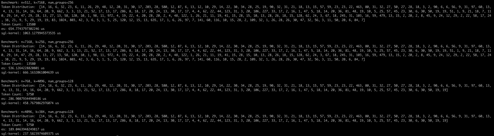

# Expert Specialization MoE Kernel
## Introduction
Inspired by this [issue](https://github.com/sgl-project/sglang/issues/5309), the load of experts may vary depending on the scenario and is dynamically changing. Furthermore, this distribution is usually uneven, typically, most experts process only a small number of tokens, while a few experts handle a very large number of tokens.

Currently, Grouped GEMM based on CUTLASS or Triton have become the standard solution for MoE modules. Typically, these Grouped GEMM implementations use a single matrix tiling strategy, such as (128, 128, 128). However, a single tiling strategy cannot efficiently handle all scenarios with varying numbers of tokens. When the number of expert tokens is small, using larger matrix tile can lead to unnecessary computations. Conversely, when the number of expert tokens is large, using smaller matrix tile may fail to fully utilize the hardware's power.

Therefore, I implemented a new MoE module solution based on CUTLASS. Create multiple kernels with different matrix tile sizes, and dynamically dispatch tasks to each kernel based on problem sizes. To avoid the overhead of kernel prologue and epilogue, I use PDL features for optimization.

## Install
```bash
git clone --recursive https://github.com/HydraQYH/expert_specialization_moe.git
cd expert_specialization
pip install -v --no-build-isolation -e .
```

## Unitest(Accuracy)
```bash
pytest -s ./test/test_es_grouped_gemm.py
```

## Benchmark(Performance)
```bash
python3 ./benchmark/benchmark_es_fp8_blockwise_moe.py
```

## Result
I haven't yet tuned the performance now. However, preliminary test results on the H20 GPU show that the Expert Specialization MoE Kernel offers significant performance improvements compared to the sgl-kernel(0.3.9.post2), especially when the workload across different expert  is unbalanced:


## TODO
Currently, I only support one type of Grouped GEMM (SM90 FP8 Blockwise). The two main tasks that follow are:
- [ ] Support more types of Grouped GEMM.
- [ ] Tune the performance for different scenarios.

## Contact
If you have any questions or suggestions, or perhaps you want to participate in the development process, please feel free to contact me. Both of these email addresses are valid:
- qyh820@outlook.com
- qiyuhang0820@gmail.com

